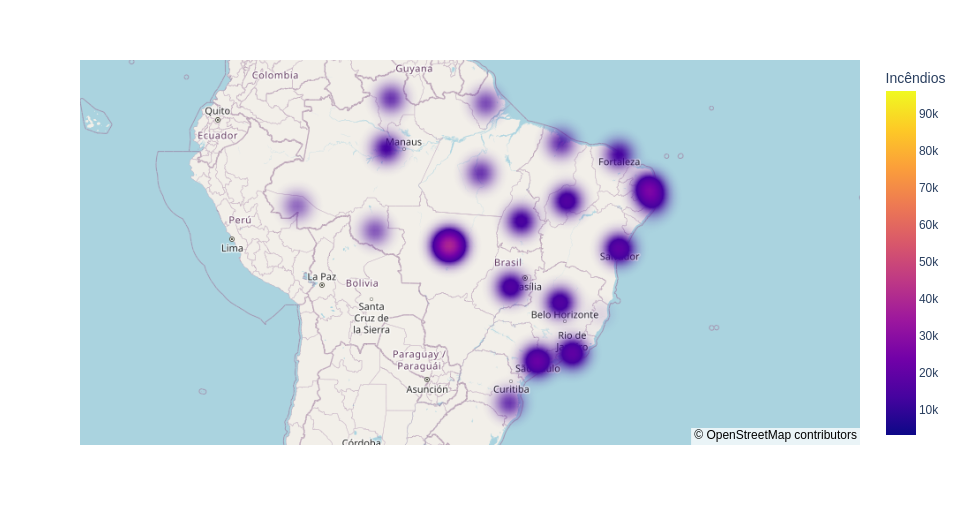

# Incêndios Florestais No Brasil

## Ojetivo:

Este projeto foi conduzido com o propósito de realizar uma análise dos incêndios florestais no Brasil ao longo dos anos de 1997 a 2017. A investigação abrangeu um período de duas décadas, visando compreender e avaliar a incidência desses eventos ao longo do tempo.

## Imagem

### Mapa de Incêndios Florestais no Brasil

## Como Visualizar o Codigo?
Basta clicar no arquivo "incendios-florestais.ipynb" irá abrir uma versão web do notebook onde estão os codigos, o mapa não é visivel na versão web.
